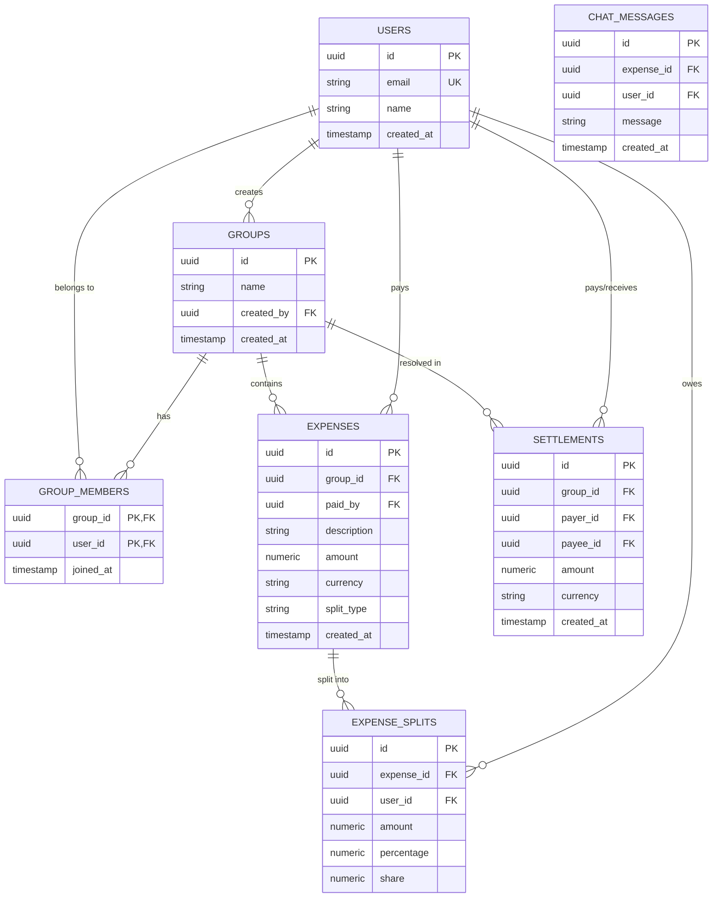

# SCOPE.md — Anomaly Log & Database Schema

This document details every data anomaly detected in the historical expense sheet (`expenses_export.csv`) and our programmatic resolution strategy, followed by the final relational database schema.

---

## 1. CSV Data Anomaly Log

Below is the complete audit trail of anomalies identified in the CSV file and how they are handled by our ingestion engine:

| CSV Row | Column | Anomaly Type | Original Value | Resolution / Action Taken | Severity |
| :--- | :--- | :--- | :--- | :--- | :--- |
| **6** | `description` | Duplicate Entry | `dinner - marina bites` | Flagged as a duplicate of Row 5 (same date, same payer, same amount). Deselected from import by default. | Warning |
| **7** | `amount` | Number Formatting | `"1,200"` | Comma in string amount parsed as number `1200`. | Info |
| **9** | `paid_by` | Casing Mismatch | `priya` | Normalized lowercase name to `Priya` to match system profiles. | Info |
| **10** | `amount` | Excess Decimal Precision | `899.995` | Rounded 3-decimal currency value to standard `900.00` (2 decimals). | Info |
| **11** | `paid_by` | Unregistered Payer | `Priya S` | Standardized to `Priya` to prevent creating duplicate user accounts (since split list uses `Priya`). | Info |
| **13** | `paid_by` | Missing Payer | *(Blank)* | Assigned to placeholder "Unknown Payer" to maintain balance sheet integrity (Note: "can't remember who paid"). | Error |
| **14** | `split_type` | Settlement Reclassification | *(Blank split_type)* | Description "Rohan paid Aisha back" identified as a transfer. Reclassified as direct Settlement instead of Expense. | Warning |
| **15** | `split_details`| Incorrect Percentage Sum | `Aisha 30%; Rohan 30%; Priya 30%; Meera 20%` | Percentages summed to 110%. Re-normalized proportionally to sum to 100% (27.27% each for Aisha/Rohan/Priya, 18.18% for Meera). | Warning |
| **16** | `date` | Date Format Mismatch | `01/03/2026` | DD/MM/YYYY parsed and standardized to ISO `2026-03-01`. | Info |
| **17** | `date` | Date Format Mismatch | `03/03/2026` | DD/MM/YYYY parsed and standardized to ISO `2026-03-03`. | Info |
| **18** | `date` | Date Format Mismatch | `05/03/2026` | DD/MM/YYYY parsed and standardized to ISO `2026-03-05`. | Info |
| **19** | `date` | Date Format Mismatch | `08/03/2026` | DD/MM/YYYY parsed and standardized to ISO `2026-03-08`. | Info |
| **20** | `date` | Date Format Mismatch | `09/03/2026` | DD/MM/YYYY parsed and standardized to ISO `2026-03-09`. | Info |
| **20** | `currency` | Currency Mismatch | `USD` | Supported USD natively; transactions kept in USD to calculate separate debt simplification ledgers. | Info |
| **21** | `date` | Date Format Mismatch | `10/03/2026` | DD/MM/YYYY parsed and standardized to ISO `2026-03-10`. | Info |
| **22** | `date` | Date Format Mismatch | `10/03/2026` | DD/MM/YYYY parsed and standardized to ISO `2026-03-10`. | Info |
| **23** | `date` | Date Format Mismatch | `11/03/2026` | DD/MM/YYYY parsed and standardized to ISO `2026-03-11`. | Info |
| **23** | `split_with` | Unregistered Split Member | `Dev's friend Kabir` | Automatically created a system profile for "Dev's friend Kabir" to track flight splits. | Info |
| **24** | `date` | Date Format Mismatch | `11/03/2026` | DD/MM/YYYY parsed and standardized to ISO `2026-03-11`. | Info |
| **25** | `date` | Date Format Mismatch | `11/03/2026` | DD/MM/YYYY parsed and standardized to ISO `2026-03-11`. | Info |
| **25** | `description` | Potential Conflict / Duplicate | `Thalassa dinner` | Flagged duplicate warning (amount and date match row 24 dinner, different payer). Ingested but marked for user review. | Warning |
| **26** | `date` | Date Format Mismatch | `12/03/2026` | DD/MM/YYYY parsed and standardized to ISO `2026-03-12`. | Info |
| **26** | `amount` | Negative Refund Split | `-30` | Negative expense allowed (constraint adjusted in PG to `amount <> 0`) to correctly decrease split balances. | Info |
| **27** | `date` | Incomplete Date | `Mar 14` | Inferred year `2026` based on chronological surrounding transactions -> `2026-03-14`. | Info |
| **27** | `paid_by` | Casing & Trailing Space | `rohan ` | Trimmed and capitalized to `Rohan`. | Info |
| **28** | `date` | Date Format Mismatch | `15/03/2026` | DD/MM/YYYY parsed and standardized to ISO `2026-03-15`. | Info |
| **28** | `currency` | Missing Currency | *(Blank)* | Note says "forgot to set currency". Defaulted to `INR` based on transaction size and location. | Warning |
| **29** | `date` | Date Format Mismatch | `18/03/2026` | DD/MM/YYYY parsed to `2026-03-18`. | Info |
| **29** | `amount` | Whitespace Padding | ` 1450 ` | Stripped leading/trailing spaces -> parsed to `1450`. | Info |
| **30** | `date` | Date Format Mismatch | `20/03/2026` | DD/MM/YYYY parsed to `2026-03-20`. | Info |
| **31** | `date` | Date Format Mismatch | `22/03/2026` | DD/MM/YYYY parsed to `2026-03-22`. | Info |
| **31** | `amount` | Zero Amount | `0` | Ingested zero amount expense. Does not change balances. | Warning |
| **32** | `date` | Date Format Mismatch | `25/03/2026` | DD/MM/YYYY parsed to `2026-03-25`. | Info |
| **32** | `split_details`| Incorrect Percentage Sum | `Aisha 30%; ...` | Percentages summed to 110%. Normalised sum back to 100%. | Warning |
| **33** | `date` | Date Format Mismatch | `28/03/2026` | DD/MM/YYYY parsed to `2026-03-28`. | Info |
| **34** | `date` | Date Ambiguity | `04/05/2026` | Note asks "April 5 or May 4?". Resolved to `2026-04-05` (April 5th) to maintain chronological ledger ordering. | Warning |
| **36** | `split_with` | Former Member Split | `Meera` | Meera moved out on March 29th, but included in April 2 groceries. Kept split as logged but flagged as former member anomaly. | Warning |
| **38** | `split_type` | Settlement Reclassification | `equal` | Sam deposit share paid to Aisha. Reclassified as direct Settlement transfer from Sam to Aisha. | Warning |
| **42** | `split_details`| Redundant Split Details | `Aisha 1; Rohan 1; ...`| Split type is equal, but share details were added. Redundant shares ignored, split equally. | Info |

---

## 2. Database Schema

The relational database is built on Supabase PostgreSQL. Decoupling user profiles from Auth tables allows the app to cleanly manage unregistered members.

### Entity-Relationship Diagram

### Table Specifications

1. **`users`**
   * `id`: `uuid` (Primary Key, defaults to `gen_random_uuid()`)
   * `email`: `text` (Unique, Nullable - allows email-less members)
   * `name`: `text` (Not Null)
   * `created_at`: `timestamp with time zone`

2. **`groups`**
   * `id`: `uuid` (Primary Key)
   * `name`: `text`
   * `created_by`: `uuid` (References `users.id`)
   * `created_at`: `timestamp with time zone`

3. **`group_members`**
   * `group_id`: `uuid` (References `groups.id` ON DELETE CASCADE)
   * `user_id`: `uuid` (References `users.id` ON DELETE CASCADE)
   * Primary Key: `(group_id, user_id)`

4. **`expenses`**
   * `id`: `uuid` (Primary Key)
   * `group_id`: `uuid` (References `groups.id` ON DELETE CASCADE)
   * `paid_by`: `uuid` (References `users.id` ON DELETE SET NULL, Nullable)
   * `description`: `text`
   * `amount`: `numeric(12, 2)` (No amount check constraint, allowing zero-amount adjustments and negative refunds)
   * `currency`: `text` (Defaults to `'INR'`)
   * `split_type`: `text` (Values: `'equal'`, `'unequal'`, `'percentage'`, `'share'`)
   * `created_at`: `timestamp with time zone`

5. **`expense_splits`**
   * `id`: `uuid` (Primary Key)
   * `expense_id`: `uuid` (References `expenses.id` ON DELETE CASCADE)
   * `user_id`: `uuid` (References `users.id` ON DELETE CASCADE)
   * `amount`: `numeric(12, 2)` (Actual calculated debt share)
   * `percentage`: `numeric(5, 2)` (Nullable)
   * `share`: `numeric(10, 2)` (Nullable)

6. **`settlements`**
   * `id`: `uuid` (Primary Key)
   * `group_id`: `uuid` (References `groups.id` ON DELETE CASCADE)
   * `payer_id`: `uuid` (References `users.id` ON DELETE SET NULL)
   * `payee_id`: `uuid` (References `users.id` ON DELETE SET NULL)
   * `amount`: `numeric(12, 2)` (Check constraint: `amount > 0`)
   * `currency`: `text` (Defaults to `'INR'`)
   * `created_at`: `timestamp with time zone`
